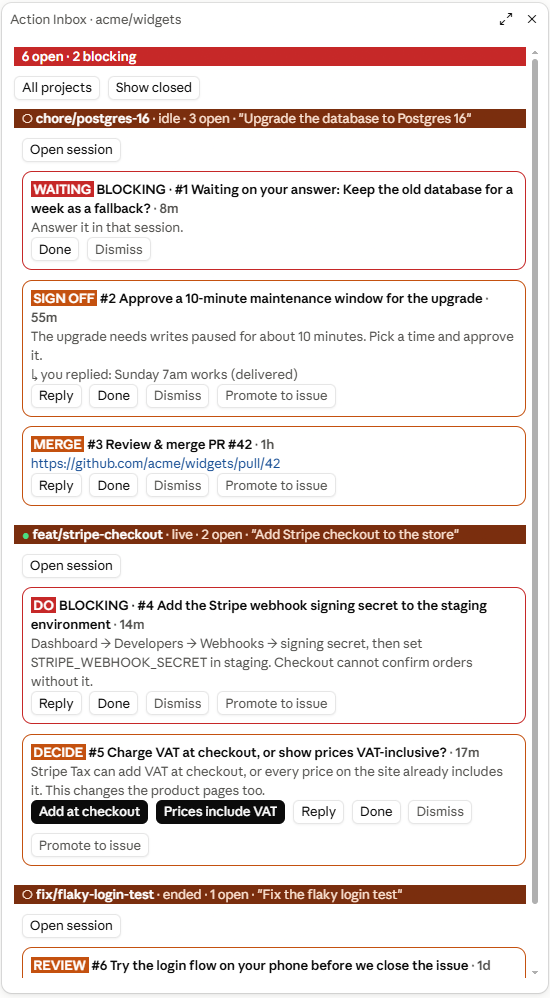

# Action Inbox for Claude Code and GitHub Copilot

**One list of everything your agent sessions are waiting on you for, across every session in a project — Claude Code and GitHub Copilot alike.**

When you run several sessions at once, the important asks go missing in the scroll: "pick option A or B", "set this secret in the portal", "sign off this ADR", "review and merge PR #42". Action Inbox catches each one, files it under the session that raised it, and sends your answer back to that session.

It ships in two editions that share one inbox on your machine:
- **Claude Code**: a [Claude Code plugin](https://docs.claude.com/en/docs/claude-code) built on function hooks: a pane, a bar above the prompt, three tools for Claude, and a `/inbox` command.
- **GitHub Copilot** (Copilot CLI and VS Code): an [agent plugin](https://docs.github.com/en/copilot/concepts/agents/about-plugins) in [`copilot/`](copilot) with an MCP server, hooks, a skill, and a terminal command. See [GitHub Copilot](#github-copilot).

An item a Copilot session raises shows up in the Claude Code pane, and a reply you type in either place goes back to the session that asked.

<p align="center">
  
</p>

The bar above the prompt keeps the count in view in every session:


<sub>Screenshots use a demo project with made-up items.</sub>

## What it does

**Catches what you owe, three ways**
- **Claude logs it.** Each session gets `inbox_add`, `inbox_resolve` and `inbox_list` tools and a short instruction: whenever it asks you to decide or do something by hand, it logs it as well as saying it in chat.
- **Automatically.** A successful `gh pr create` adds a *Review & merge PR #N* item, which closes itself when the PR merges (on `gh pr merge`, or when GitHub reports it merged or closed). A session blocked on a question or a plan approval shows as *Waiting on you* in every other session until you answer.
- **By hand.** `/inbox add Call the accountant about VAT`.

**Shows it in one place**
- An orange bar above the prompt with the open count, and a pane (`/inbox`) grouped by project, then by session. Each session header shows whether it is live, idle or ended. Blocking items come first.
- Each item has buttons for its options (for decisions), **Reply**, **Done**, **Dismiss** and **Promote to issue**. Other sessions have an **Open session** button.
- A toast when another session raises something. A push notification for decisions, sign-offs and blocking items, if the session is allowed to send them.

**Sends your answer back**
- A reply or an option you pick goes to the session that raised the item. It is submitted there as your prompt and starts a turn as soon as that session is idle. If the session has ended, the reply waits until you resume it.
- Marking an item Done or Dismissed is passed to that session quietly, with your next prompt there.

**Works from your phone** (through Remote Control)
- `/inbox list` gives a numbered list, and the pane numbers items the same way.
- `/inbox reply 3 go ahead`, `/inbox pick 3 2`, `/inbox done 3`, `/inbox issue 3`, `/inbox open 3`. These run even while the session is busy.

## Requirements

- **Claude Code 2.1.288 or newer** (the desktop app's Code tab, or the CLI). Function-hook plugins are **early access**, and the API may change between releases.
- **GitHub CLI (`gh`)**, signed in. It is needed for PR tracking and *Promote to issue*. Everything else works without it.
- **Open session** needs the Claude desktop app on Windows or macOS.

## Install

1. Clone it somewhere permanent:
   ```bash
   git clone https://github.com/samuelnyamukapa/claude-code-action-inbox.git ~/.claude/mods/action-inbox
   ```
2. Load it in every session by adding this to `~/.claude/settings.json`, using the absolute path to the folder:
   ```json
   {
     "env": {
       "CLAUDE_CODE_PLUGIN_DIRS": "/Users/you/.claude/mods/action-inbox"
     }
   }
   ```
   On Windows, use a path like `C:\\Users\\you\\.claude\\mods\\action-inbox`. To list several plugin folders, separate them with your platform's path-list separator (`;` on Windows, `:` elsewhere).

   To try it in one session only, use `claude --plugin-dir ~/.claude/mods/action-inbox`.
3. Start a new session and type `/inbox`.

## GitHub Copilot

The Copilot edition has no pane: Copilot plugins cannot draw UI. Instead you work the inbox through chat (`inbox list`, `inbox reply 3 go ahead`), from a terminal, or from the Claude Code pane if you also use Claude Code.

### Install

**Copilot CLI**
```bash
copilot plugin install samuelnyamukapa/claude-code-action-inbox:copilot
```
Or add the repository as a marketplace (`copilot plugin marketplace add samuelnyamukapa/claude-code-action-inbox`) and install `action-inbox` from it.

**VS Code** (agent plugins, preview): clone the repository and point VS Code at the `copilot` folder in your settings:
```json
{
  "chat.pluginLocations": { "/path/to/claude-code-action-inbox/copilot": true }
}
```
Install it from the folder, not with *Install Plugin from Source* on the repository root: the root is the Claude Code edition.

Both need **Node.js 18 or newer** on your PATH. The built files in `copilot/dist` are committed, so there is nothing to build.

### What you get

| Part | What it does |
|---|---|
| MCP server `action-inbox` | `inbox_add`, `inbox_resolve` and `inbox_list` (the same tools Claude gets), plus `inbox_command`, which runs your own `inbox …` commands when you type them in chat. Clients that show MCP prompts also get an `inbox` prompt. |
| Hooks | Tell the server which session is calling, so items are filed under it. Log a *Review & merge PR #N* item on `gh pr create` and close it on `gh pr merge`. Show *Waiting on your answer* while Copilot's `ask_user` question is open. Deliver your replies. |
| Skill `action-inbox` | The instructions: log what the user owes, act on `[Action Inbox]` replies, pass `inbox …` commands through. |
| `dist/cli.mjs` | The inbox from a terminal: `node copilot/dist/cli.mjs list`, `… reply 3 go ahead`, `… pick 3 2`, `… done 3`, `… issue 3`, `… add <text>`. Use `--cwd <dir>` to pick the project. |

### How replies reach a Copilot session

Copilot has no way for a plugin to start a turn in an idle session, so a reply waits for the session's next step:
- at its **next tool call**, as added context;
- when it **finishes a turn**, by starting one more turn with your reply;
- at the **start** of a resumed session.

If the session is idle, send it any prompt (even "continue") and the reply arrives with it.

### Differences from the Claude Code edition

- No pane, no bar above the prompt, no toasts or push notifications.
- *Open session* works only for Claude Code sessions in the desktop app.
- Without hooks (for example, in a client that only loads the MCP server and skill), items are filed under a *Copilot session* group and replies are not delivered automatically; `inbox_list` still shows them.

## Commands

In Claude Code:

| Command | What it does |
|---|---|
| `/inbox` | Open the pane for this project (`/inbox all` shows every project) |
| `/inbox list` | Numbered plain-text list, with each decision's options |
| `/inbox reply <n> <text>` | Reply to item *n*; it goes to the session that raised it |
| `/inbox pick <n> <option>` | Choose an option of decision *n*, by number or label |
| `/inbox done <n> [note]` / `dismiss <n>` | Close item *n* |
| `/inbox issue <n>` | Create a GitHub issue from item *n* |
| `/inbox open <n>` | Open the session that raised item *n* in the desktop app |
| `/inbox add <text>` | Add your own item |

## How it works

- **Storage.** Everything lives on your machine under `~/.claude/action-inbox/<project>/`, for both editions. Each item and each event (a reply, a status change, a delivery) is its own small JSON file, written once and never edited. That way any number of sessions can write at the same moment without overwriting each other. Each session also keeps a heartbeat file, which is how the pane knows whether it is live.
- **Projects.** A project is keyed by its git `origin` remote, so every worktree of one repository shares one inbox. A project with no remote is keyed by its main worktree folder.
- **Replies.** The owning session polls the folder every few seconds. It delivers each undelivered reply once with `prompt.submit` and records the delivery, so a reply is never sent twice.
- **Resumed sessions.** A session resumed under a new id takes back the items it raised by finding its own `inbox_add` calls in its transcript.

## Privacy

Nothing leaves your machine unless you ask for it:
- **Promote to issue** sends the item's title and details to GitHub, and only after you confirm.
- Push notifications go through Claude Code's own notification tool.
- The inbox files hold item titles and details, and each session's first prompt (trimmed to 60 characters) as its label. Delete `~/.claude/action-inbox/` at any time to start over.

## Limitations

- Claude Code and GitHub Copilot (CLI and VS Code) sessions take part. Cowork and other Claude surfaces do not load plugins.
- Closed items drop out of the pane after 24 hours, but their files stay on disk.
- The colours are fixed: white text on burnt orange, rust and red, all at least 4.5:1 contrast. Native buttons follow the app's own theme.

## Development

```bash
claude plugin validate .
claude plugin test .
```

The hooks module is `hooks/register.tsx`. The pure logic is in `hooks/model.ts`, which holds the folding, numbering, command parsing and issue text, and is what the tests in `tests/` cover. Saving a file reloads the plugin in every session that loads this folder.

The Copilot edition lives in `copilot/src` and reuses `hooks/model.ts`; `copilot/src/inbox.ts` is the same storage on plain Node. Rebuild `copilot/dist` after changing either, and commit the result:

```bash
npm install
npm run build
npm run test:copilot
```

Two environment variables help when trying it in a real agent: `ACTION_INBOX_HOME` points the Copilot edition at a throwaway inbox folder instead of `~/.claude/action-inbox`, and `ACTION_INBOX_DEBUG=<file>` makes every hook call append its payload and answer to that file. The hooks answer in the caller's own shape, so the same build also runs under Claude-compatible hook runners such as Codex and VS Code.

## Licence

[MIT](LICENSE)
